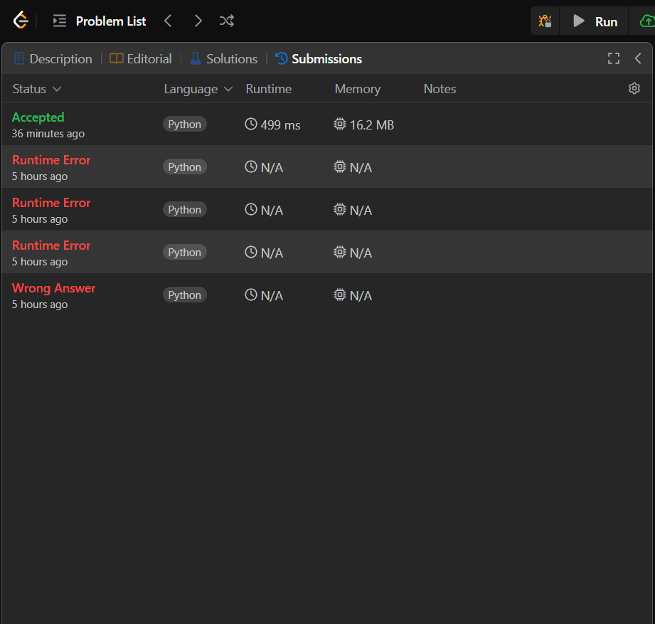
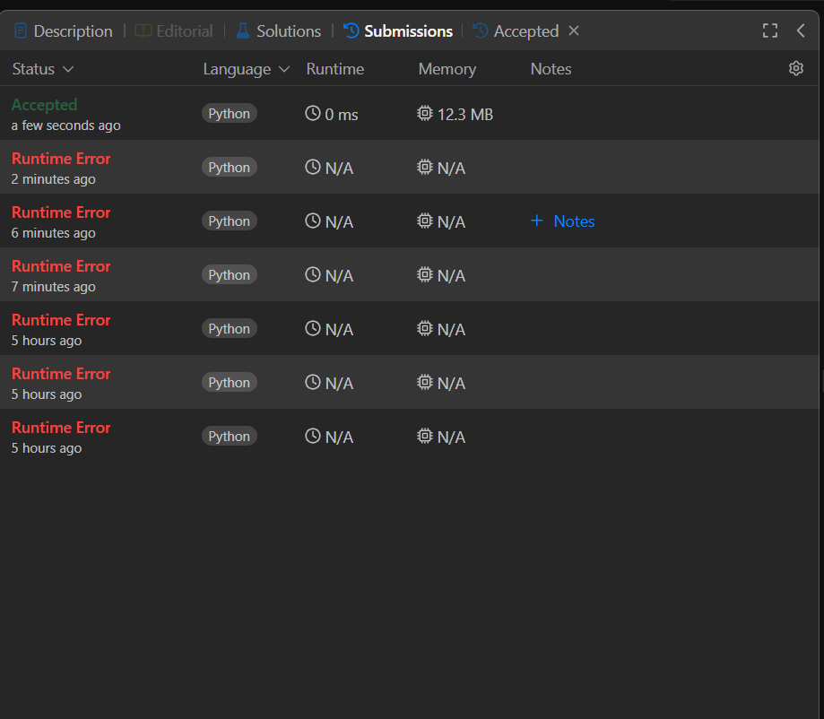
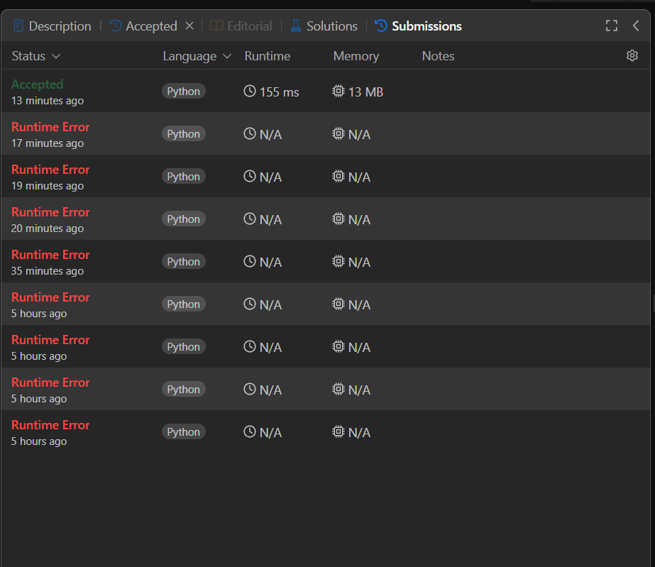

# Grafos2-59_LeetCode_Problems

**Número da Lista**: 1 
**Conteúdo da Disciplina**: Grafos 2 

## Alunos
|Matrícula | Aluno |
| -- | -- |
| 20/0043030  |  Renann de Oliveira Gomes |

## Sobre 
Desafios resolvidos do LeetCode 

| Problema | Descrição                    | Nível de Dificuldade |
|----------|-------------------------------|-----------------------|
| 664     | Strange printer | Difícil                |
| 655     | Print Binary Tree | Média                |
| 2646     | Minimize The Total Price of the Trips | Difícil               |

## Screenshots

Desafio 664

Desafio 655 

Desafio 2646

## Instalação 
**Linguagem**: python 

## Uso 
Ao final do script descomente a linha que tem o caso de teste que deseja ver e execute no terminal "python {caminho_solucao_}.py"